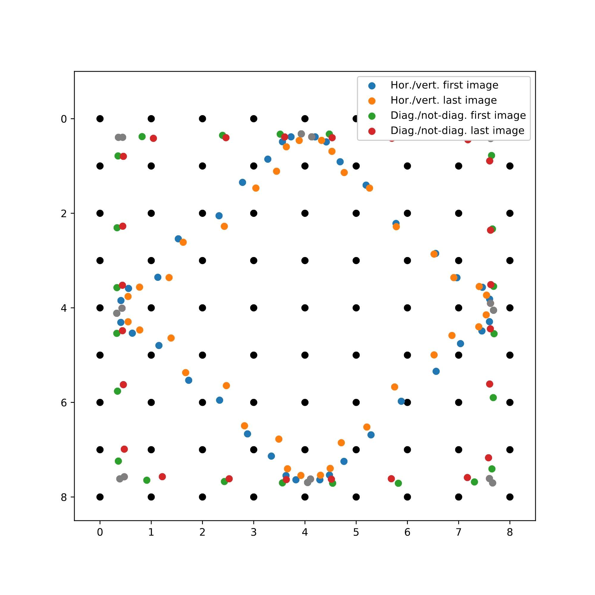

# Viewpoint Interpolation of Light Fields Using Variational Autoencoders

## Scaling in Latent Space

Scaling the latent representation before decoding it did not change the viewpoints, but it did change the color of the images. The GIFs below are made from the leftmost image of the centre horizontal slice, where the latent reprentation was scaled by 0.5, 0.75, 1, 1.5, and 2, respectively. The first one is for the autoencoder, the second one for the variational autoencoder.

## Latent Space Interpolation

Below are GIFs demonstrating our ability to interpolate in latent space. The images in the GIFs are always the first image in the generated light field slice.

### Autoencoder

In the first GIF, we are interpolating between the center horizontal and vertical slices. In the second one, we are interpolating between a horizontal and a diagonal, and a diagonal and a vertical slice. The positions of the generated viewpoints (both the first and last image of the generated slice) are presented in the plot below. The grey dots represent the images where no interpolation was done.

### Variational Autoencoder

## Corrections

There was an error in the function that determines the position of the viewpoints, which caused it to not calculate the position if it was too close the the lower and right edges of the grid. However, this only caused some positions to be missing from some plots, and does not change our results.
