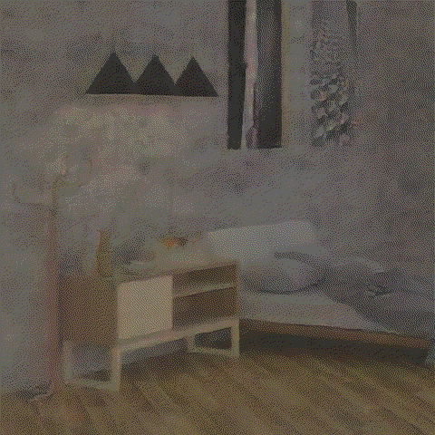
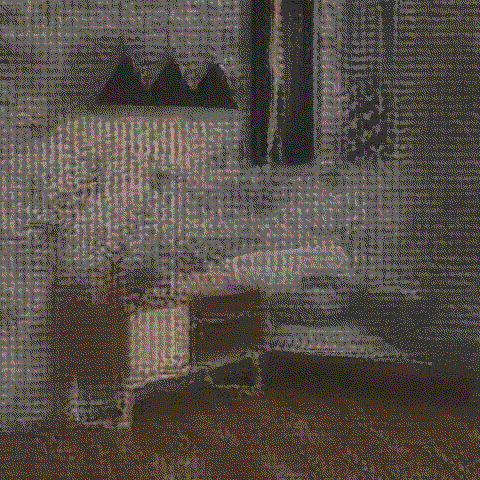

# Viewpoint Interpolation of Light Fields Using Variational Autoencoders

## Scaling in Latent Space

Scaling the latent representation before decoding it did not change the viewpoints, but it did change the color of the images. The GIFs below are made from the leftmost image of the centre horizontal slice, where the latent reprentation was scaled by 0.5, 0.75, 1, 1.5, and 2, respectively. The first one is for the autoencoder, the second one for the variational autoencoder.

